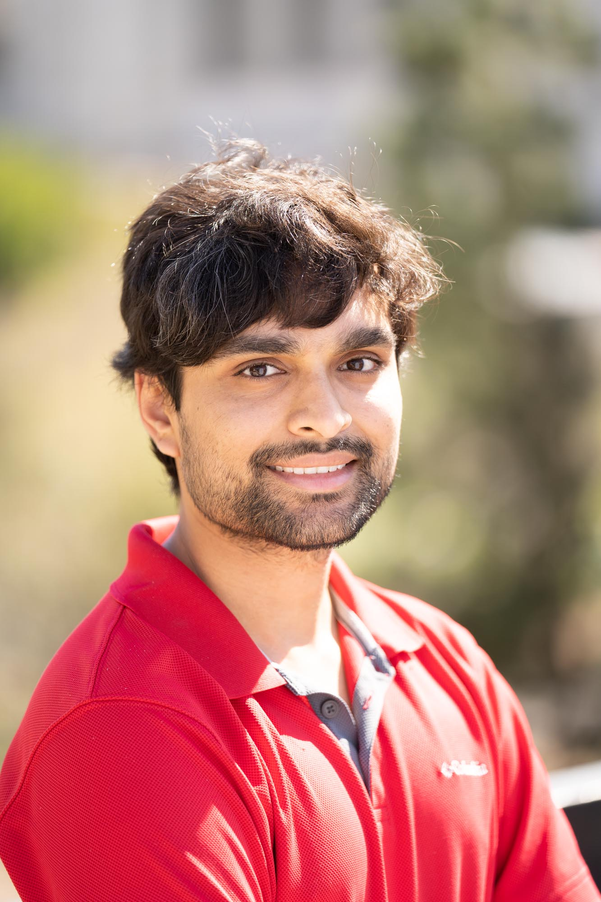

I am a master's student at Carnegie Mellon University's Machine Learning Department. Applications of machine learning in medicine, natural language processing, neuroscience and vision are of particular interest to me. In my spare time, I engage in quizzing, photography, gaming, playing badminton and running.

# Education
*   2018 - 2019
M.S. Machine Learning from Carnegie Mellon University

*   2014 - 2018   
B.E.(Hons) Computer Science from BITS Pilani, Hyderabad

*   2012 - 2014   
Senior secondary education from   
Sri Kumaran Children's Home - CBSE, Bangalore

*   2002 - 2012   
Primary and secondary education from    
Sri Kumaran Public School - ICSE, Bangalore

# Awards and Honours

*   Gold Medalist, BITS Pilani, Hyderabad
*   Best All-Rounder Award, Prof. V.S. Rao Foundation, BITS Pilani, Hyderabad
*   DAAD WISE 2017 Scholar
*   Merit Scholarship from BITS Pilani for four consecutive years
*   TCS IT Wiz 2013 Bangalore Runner-Up
*   IAYP Bronze Award

# Publications

* **Aniketh Janardhan Reddy**, Gil Rocha, and Diego Esteves. 2018. DeFactoNLP: Fact Verification using Entity Recognition, TFIDF Vector Comparison and Decomposable Attention. FEVER 2018 at EMNLP 2018. [[Paper]](https://arxiv.org/abs/1809.00509) [[Code]](https://github.com/DeFacto/DeFactoNLP)

* Diego Esteves, **Aniketh Janardhan Reddy**, Piyush Chawla, and Jens Lehmann. 2018. Belittling the Source: Trustworthiness Indicators to Obfuscate Fake News on the Web. FEVER 2018 at EMNLP 2018. [[Paper]](https://arxiv.org/abs/1809.00494) [[Code]](https://github.com/DeFacto/WebCredibility}

*	Diego Esteves, Anisa Rula, **Aniketh Janardhan Reddy**, and Jens Lehmann. 2018. Toward Veracity Assessment in RDF Knowledge Bases: An Exploratory Analysis. J. Data and Information Quality 9, 3, Article 16 (February 2018), 26 pages. [[Paper]](https://doi.org/10.1145/3177873)

* **Aniketh Janardhan Reddy**, Monica Adusumilli, Sai Kiranmai Gorla, Lalita Bhanu Murthy Neti and Aruna Malapati. 2018. Named Entity Recognition for Telugu using LSTM-CRF. WILDRE4 at LREC 2018. [[Paper]](http://lrec-conf.org/workshops/lrec2018/W11/summaries/2_W11.html) [[Code]](https://github.com/anikethjr/NER_Telugu)

# Projects

*   Utilized functional magnetic resonance imaging (fMRI) and machine learning techniques to identify which brain regions are involved in attention modulation. I was guided by Dr. Sridharan Devarajan at the Cognition Lab, Indian Institute of Science, Bangalore, India.

*   Developed an automated fact verification system called DeFactoNLP which could not only assess the veracity of a claim but also retrieve supporting evidences from Wikipedia - [https://github.com/DeFacto/DeFactoNLP](https://github.com/DeFacto/DeFactoNLP)

*   Built a system which could automatically ascertain the trustworthiness of a website - [https://github.com/DeFacto/WebCredibility](https://github.com/DeFacto/WebCredibility)

*   Participated in the development and benchmarking of DeFacto, a triple verification framework.

*   I worked on the recognition of named entities in texts written in Indian languages. My work on Named Entity Recognition (NER) in Telugu texts using an LSTM-CRF classifier can be found at [https://github.com/anikethjr/NER_Telugu](https://github.com/anikethjr/NER_Telugu).

*   I built a C++ based framework to build artificial neural networks. It can be found at [https://github.com/anikethjr/NeuralNets](https://github.com/anikethjr/NeuralNets).

*   An FP Tree implementation which I coded using C++ can be found at [https://github.com/anikethjr/FPTree](https://github.com/anikethjr/FPTree).

*   TeChess is a chess bot which I built in early 2017. It makes use of PVS search and its code can be found at [https://github.com/anikethjr/TeChess](https://github.com/anikethjr/TeChess).

*   I coded the ID3, Reduced Error Pruning, Random Forests and AdaBoost algorithms in C++. The code is at [https://github.com/anikethjr/decision-tree](https://github.com/anikethjr/decision-tree).

*   Two cloth simulation models, one which uses the spring mass model and the other which uses an internal energy model, implemented in C++ using OpenGL are at [https://github.com/anikethjr/Cloth-Simulation](https://github.com/anikethjr/Cloth-Simulation).

*   An interactive application to draw Bezier Curves and generate surfaces of revolution can be found at [https://github.com/anikethjr/BezierCurves](https://github.com/anikethjr/BezierCurves). It was implemented in C++ and uses OpenGL.

*   Recently, I built a framework which implements L-Systems using OpenGL. The code can be found at [https://github.com/anikethjr/LSystems](https://github.com/anikethjr/LSystems).

*   To experiment with 3D modelling using OpenGL and Blender, I built a children's playground using them. The code for this project is at [https://github.com/anikethjr/Playground-OpenGL](https://github.com/anikethjr/Playground-OpenGL).

*   A Python implementation of the SVD and CUR algorithms can be found at [https://github.com/anikethjr/SVD_CUR](https://github.com/anikethjr/SVD_CUR).

*   An implementation of the Apriori algorithm can be found at [https://github.com/anikethjr/Apriori](https://github.com/anikethjr/Apriori).

*   I built semantic and syntactic vector space models using Python. The code for this project is at [https://github.com/anikethjr/VSM](https://github.com/anikethjr/VSM).

*   Some games which I made in Python using CodeSkulptor can be found at [https://github.com/anikethjr/Python-Games](https://github.com/anikethjr/Python-Games). 
